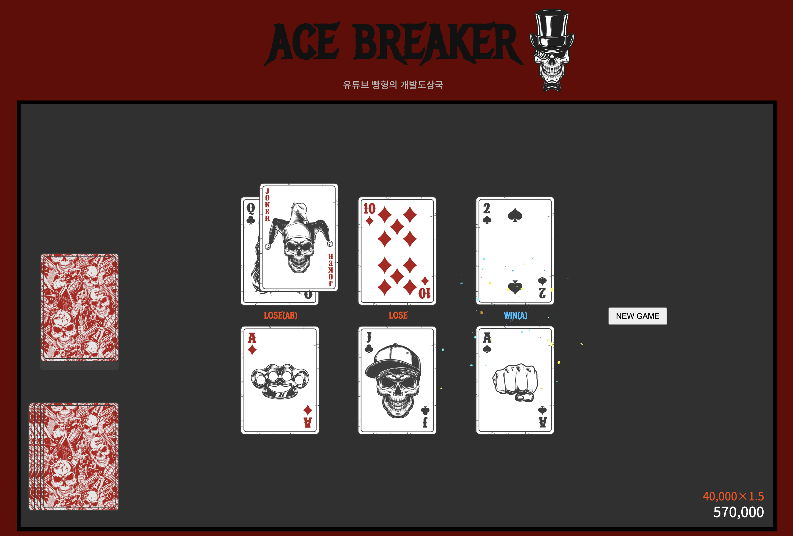

ACE BREAKER
========

Play: https://kairess.github.io/ace-breaker

## Rules

### 한국어

1. **카드 받기**: 게임 시작 시, 각 플레이어는 3장의 카드를 받습니다.
2. **카드 교환**: 플레이어는 한 번에 한 번, 새로운 카드로 교환할 수 있는 기회가 있습니다.
3. **베팅**: 플레이어는 원하는 금액을 베팅합니다. 단, 플레이어는 딜러보다 더 높은 금액을 베팅해야 합니다.
4. **카드 오픈**: 베팅이 완료되면, 플레이어들은 자신의 카드를 오픈합니다.
5. **승리 조건**:
   - 첫 번째 카드: 상대방의 카드보다 높아야 승리합니다.
   - 두 번째 카드: 상대방의 카드보다 낮아야 승리합니다.
   - 세 번째 카드: 상대방의 카드보다 높아야 승리합니다.
6. **Ace 카드**: Ace는 조커를 제외한 모든 카드보다 강합니다.
7. **조커 카드**: 조커는 Ace를 이길 수 있으며, 약 1.9%의 확률로 나옵니다.

**승리 보상**: 승리 시, Ace의 개수와 조커의 개수에 따라 베팅한 금액의 추가 배수를 받습니다.
   - Ace가 있으면 베팅 금액의 +50% 추가.
   - 조커가 있으면 베팅 금액의 +100% 추가.

### English

1. **Receiving Cards**: At the start of the game, each player is dealt three cards.
2. **Card Exchange**: Players have one opportunity to exchange their cards for new ones.
3. **Betting**: Players place their bets with the amount they choose. Note that each player must bet a higher amount than the dealer.
4. **Revealing Cards**: Once the betting is complete, players reveal their cards.
5. **Winning Conditions**:
   - First Card: Must be higher than the opponent’s to win.
   - Second Card: Must be lower than the opponent’s to win.
   - Third Card: Must be higher than the opponent’s to win.
6. **Ace Card**: The Ace beats all other cards, except for the Joker.
7. **Joker Card**: The Joker can beat the Ace and appears with a 1.9% probability.

**Winning Rewards**: When you win, the number of Aces and Jokers you have increases the winning amount.
   - For each Ace: +50% extra on the bet amount.
   - For a Joker: +100% extra on the bet amount.

## Special Thanks to 옥냥이

https://www.youtube.com/watch?v=PO6c4P1_p5Y

---

# Cards.js
Javascript library for card games.

I have created a lot of javascript card games. As of 12.05.2012 I've made

<a href="https://cardgames.io/spades/">Spades</a> 
| <a href="https://cardgames.io/hearts/">Hearts</a> 
| <a href="https://cardgames.io/whist/">Whist</a> 
| <a href="https://cardgames.io/gofish/">Go Fish</a> 
| <a href="https://cardgames.io/crazyeights/">Crazy Eights</a> 
| <a href="https://cardgames.io/solitaire/">Solitaire</a> 
| <a href="https://cardgames.io/freecell/">FreeCell</a> 
| <a href="https://cardgames.io/idiot/">Idiot</a> 
| <a href="https://cardgames.io/shithead/">Shithead</a> 

I've gotten many inquiries about how I make them, especially around the card animations, so I'm going to try to extract the generic parts of these games into a library for manipulating cards. To see an interactive demo and documentation you can go to <a href="http://einaregilsson.github.io/cards.js/">http://einaregilsson.github.io/cards.js/</a>.

The card deck images are made by Nicu Buculei, and are in the public domain (found on openclipart.org).
